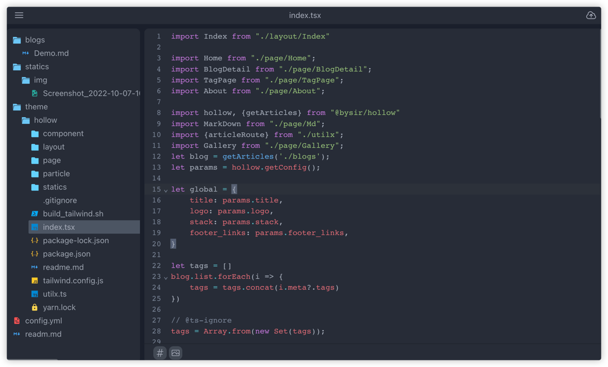

# Hollow

https://blog.bysir.top/blogs/hollow/

Hollow 是一个快速、自由的静态博客生成器。

## 特性

- **支持部署到服务器，提供 Web UI 管理文章**
  - 在任何地方（如手机上）管理你的文章
  - 云端文件也支持提交到 Git 上，不怕文件丢失
- **Js 驱动**
  - **支持 Js/Ts 作为配置文件（yaml 也支持）**
  - **使用 Jsx/Tsx 作为主题模板开发语言**
  - 主题开发没有限制，极少概念，代码即所得。
- **支持 [MDX](https://mdxjs.com/packages/mdx/)**
- 快速：生成 1000 篇页面只需要 2s (虽然没什么用)

## 适用于
 - "想要从零开发主题、网站，但不想学习框架概念" 的人
 - "需要使用 Web UI 写作" 的人

## Hollow 世界观
在 Hollow 的世界中，代码即所得，因为主题使用 JavaScript 驱动，它是图灵完备的，所以没必要再定义限制：如路由、布局、标签、归档等。不再拘谨于框架给你的概念，这次你自己创造。

当你想要实现更多需求的时候，最好的方式是自己开发"主题"，而不是让某个"主题"提供给你功能。

> 在大多数时候，复制一个已有的主题再更改更简单

主题只有一个入口，即 index.tsx，和一个平常的 JavaScript 项目一样，支持 import 或 require 语法，如何组织你的主题，这完全取决于你。

借助于 Jsx 语法，主题开发是很简单的，比如一个最简单的主题只有一个文件：

```jsx
// index.tsx
function Index(props) {
  return <html lang="zh" class="dark">
  <head>
    <meta charSet="UTF-8"/>
    <meta name="viewport" content="width=device-width, initial-scale=1.0" />
    <title>{props.title || 'UnTitled'}</title>
  </head>
  <body className="">
  <div>
    {props.body}
  </div>

  </body>
  </html>
}

export default {
    pages: [
        {
            path: '',
            component: () => {
                return <Index title={"Hi!"} body={"I am hollow"}></Index>
            },
        },
    ],
}
```

一个完整的主题例子 [看这里](https://github.com/zbysir/hollow-theme/tree/master/hollow)

## 快速开始
### 安装 Hollow
```shell
go install github.com/zbysir/hollow@latest
```
或者直接使用 Docker (更推荐): https://hub.docker.com/r/bysir/hollow

### 预览主题
> 这是一个可选步骤，用于快速查看一个主题的样子

```shell
docker run -p 9400:9400 bysir/hollow:master server -t https://github.com/zbysir/hollow-theme/tree/master/hollow
```

### 开始你的创作
- 创建项目文件夹, 如. `book`，然后进入 `book` 目录
- 创建 `contents` 文件用于存储内容
- 创建一些内容, 如文件名为 `contents/hello.md`, 内容如下:
  ```markdown
  ---
  title: "Hello Hollow"
  date: 2022-03-22
  ---
  # Hello Hollow
  write something here
  ```
- 现在你的项目结构看起来是这样的:
  ```treeview
  ./
  └── contents/
      └── hello.md
  ```
- 预览你的网站
  - 运行 Hollow 服务
    ```shell
    docker run -v ${PWD}:/source -p 9400:9400 bysir/hollow:master server -t https://github.com/zbysir/hollow-theme/tree/master/hollow
    ```
  - 打开任何浏览器访问 `http://localhost:9400`

### 发布

- 下面的命令将会构建文件到 `.dist` 目录下
  ```shell
  docker run -v ${PWD}:/source bysir/hollow:master build -o /source/.dist -t https://github.com/zbysir/hollow-theme/tree/master/hollow
  ```
  ```treeview
  ./
  ├── .dist/
  └── contents/
      └── hello.md
  ```

- 然后将文件部署到 Github page 上

## 使用 Github Action 发布
如果你的源文件托管在 Github 上，并且网站也想发布在 Github page 上，那么使用 Github Action 发布网站是最佳选择。

在 项目根目录下新建 .github/workflows/hollow.yaml，内容如下
```yaml
name: Deploy Hollow with GitHub Pages 

on:
  # Runs on pushes targeting the default branch
  push:
    branches: ["master"]

  # Allows you to run this workflow manually from the Actions tab
  workflow_dispatch:

# Sets permissions of the GITHUB_TOKEN to allow deployment to GitHub Pages
permissions:
  contents: read
  pages: write
  id-token: write

# Allow one concurrent deployment
concurrency:
  group: "pages"
  cancel-in-progress: true

jobs:
  # Build job
  build:
    runs-on: ubuntu-latest
    steps:
      - name: Checkout
        uses: actions/checkout@v3
      - name: Setup Pages
        uses: actions/configure-pages@v2
      - name: Build with Hollow
        uses: docker://bysir/hollow:master
        with:
          args: build
        env:
          SOURCE: .
          OUTPUT: ./dist
      - name: Upload artifact
        uses: actions/upload-pages-artifact@v1
        with:
          path: "./dist"

  # Deployment job
  deploy:
    environment:
      name: github-pages
      url: ${{ steps.deployment.outputs.page_url }}
    runs-on: ubuntu-latest
    needs: build
    steps:
      - name: Deploy to GitHub Pages
        id: deployment
        uses: actions/deploy-pages@v1
```

现在只需要将源文件提交到 Github 上，等 30s 网站就自动上线了。

## Editor

! Editor 已经暂停开发，因为比想象中复杂

hollow 支持在服务器上运行一个 Web Editor，现在我们写 blog 不用再打开笨重的编辑器了，甚至可以在手机上进行。



Editor 特性：

- 方便的上传图片等静态文件，支持上传到本地与 OSS（暂时支持七牛云）
- 可视化文件编辑器，管理逻辑和本地文件一致。
- 用来编辑 blog 源文件，提供富文本、markdown 编辑器。
- 用来少量的编辑主题代码，如修复 bug，更改配置。

editor 不能做的：

- 主题开发：由于 hollow 运行在服务端，不自带开发环境（如 node），所以需要要使用 webpack 等构建工具还是需要在本地执行，然后将构建产物上传到 hollow 中。(在 Editor 中上传文件十分简单)。
  同时由于 hollow 的代码编辑器肯定没有你熟悉的代码编辑器好用，所以在主题开发阶段建议还是选择你趁手的编辑器，完成之后再上传到远端。

## CLI

#### `hollow download`

你可以用这个命令下载远端代码到本地，进行二次开发。
在下载文件到本地时不会删除任何本地已有的文件，如果有需要清理的文件你需要手动删除。

#### `hollow upload`

你可以用这个命令上传的源代码到远端。
