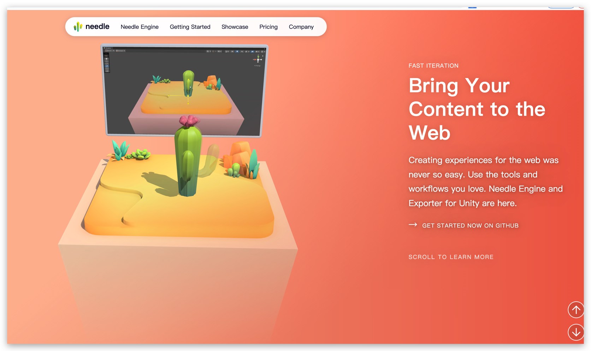

## 主题 与 项目文件隔离原则
所有不能使用 Golang 直接处理的文件，如 sass、jsx（可能依赖 tailwindcss），都应该放在主题中，由主题编译出结果直接使用。

比如以下场景的思考：
- 让项目文件支持 jsx：虽然 jsx 是支持通过 ESBuild + Goja 直接运行，但如果在 jsx 中使用了 tailwindcss，后者需要 node 环境，所以无法编译出 css 文件。
- 让项目支持 MDX：面临的问题和 jsx 一样。

不过在项目中支持 MDX 是有益处的：
- MD 不支持一些复杂排版，复杂排版的时候需要写 Html，但 Html 又太原始了，Jsx 是更好的选择。 
- 想要复用组件，如图片预设大小。
- 扩展 MD 组件，如显示图表。demo: https://editor.runjs.cool/create

## ui

- https://mambaui.com/components/article
- https://daisyui.com/

## Util
- https://g6.antv.vision/zh/docs/manual/middle/layout/graph-layout: 关系图

## file system

- https://github.com/cpuguy83/kvfs FUSE based filesystem for KV stores，可以照抄
- https://github.com/duzhanyuan/httpfs 本地文件通过 http 协议转为 fuse
- bazil.org/fuse: 抽象出 FUSE
- https://github.com/boltdb/bolt: DB 存储文件与关系
- https://github.com/etcd-io/bbolt: bblot 社区分支，更多功能 文档
- https://github.com/bazil/bolt-mount: 用 blot 作为存储层，提供 FUSE，减少开发 优选

- https://github.com/spf13/afero: 抽象出 FS，但如果要自己实现后端文件系统 还有点难，备选。

## markdown 编辑器
https://github.com/sparksuite/simplemde-markdown-editor
https://github.com/jbt/markdown-editor
https://ui.toast.com/tui-editor

## UI

- http://kenjiendo.com/album/ 黑色，大字
- https://vanschneider.com/ 字体 颜色
- https://iconmoon.com/ 好看的纯文字排版

- https://collectui.com/
- https://dribbble.com/